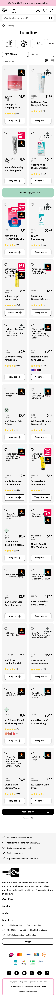
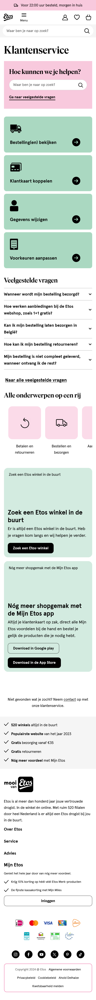

# Procesverslag
Markdown is een simpele manier om HTML te schrijven.  
Markdown cheat cheet: [Hulp bij het schrijven van Markdown](https://github.com/adam-p/markdown-here/wiki/Markdown-Cheatsheet).

Nb. De standaardstructuur en de spartaanse opmaak van de README.md zijn helemaal prima. Het gaat om de inhoud van je procesverslag. Besteedt de tijd voor pracht en praal aan je website.

Nb. Door *open* toe te voegen aan een *details* element kun je deze standaard open zetten. Fijn om dat steeds voor de relevante stuk(ken) te doen.

## Jij

  
uitwerken voor kick-off werkgroep

  ### Auteur:
  Lara Reijnen

  #### Je startniveau:
  hier je startniveau (rood)

  #### Je focus:
  surface plane

## Je website

  
uitwerken voor kick-off werkgroep

  ### Je opdracht:
  link naar de website die je gaat namaken óf de naam/omschrijving van je eigen ontwerp
  https://www.etos.nl/
  
  #### Screenshot(s) van de eerste pagina (small screen): 
   https://www.etos.nl/trending/
   Trending
  
  
  #### Screenshot(s) van de tweede pagina (small screen):
  https://www.etos.nl/klantenservice/
   service 
  
 

## Toegankelijkheidstest 1/2 (week 1)

  
uitwerken na test in 2e werkgroep

  Ik vond het lastig om de screen reader te gebruiken, want ik begreep niet precies hoe je het meost gebruiken.

  ### Bevindingen
  Lijst met je bevindingen die in de test naar voren kwamen:
  De etos heeft niet te beste screen reader (of het ligt aan mijzelf die niet snapt hoe je een screan reader gebruikt.) 
  Toen ik het gebruikte bleef hij de slogan van de etos zeggen en vertelde hij niet de tekst op de pagina, dat gebeurde 
  bij mij tenminsten, misschien dat hij het normaal wel doet.
  voor de rest is de site wel mooi opgebauwt met code. ze gebruiken heel veel divs.

  ### bevindingen met coderen
  - navigatie
  ik ben begonnen met de navigatie en na een werkgroep toen we de hamburger menu oefening moesten doen kwam ik er achter dat ik de navigatie helemaal anders moest opstellen.

  - slideshow
  door de oefeing in de werkgroep wat de slide show maken niet al te moeilijk.

  - hamburger menu
  mijn hamburger menu is werkend door javascrip alleen vind ik het vormgeven lastig met css.

  ### wat ik deze week heb geleerd
  ik heb deze week geleerd over de flexbox, grid en javasript. door de oefeingen te doen in de werkgroep ben ik er wel een stuk beter in geworden en vind ik het ook makkelijker om toe te passen in mijn site.

## Breakdownschets (week 1)

  
uitwerken na afloop 3e werkgroep

  ### de hele pagina: 
  

  ### dynamisch deel (bijv menu): 
  

  ### wellicht nog een dynamisch deel (bijv filter): 

## Voortgang 1 (week 2)

  
uitwerken voor 1e voortgang

  ### Stand van zaken
  hier dit ging goed & dit was lastig (neem ook screenshots op van delen van je website en code)

  ### Agenda voor meeting
  samen met je groepje opstellen

  | student 1      | student 2          | student 3    | student 4        |
  | ---            | ---                | ---          | ---              |
  | dit bespreken  | en dit             | en ik dit    | en dan ik dat    |
  | en dat ook nog | dit als er tijd is | nog een punt | dit wil ik zeker |
  | ...            | ...                | ...          | ...              |

  ### Verslag van meeting
  hier na afloop snel de uitkomsten van de meeting vastleggen
  Feedbac:
  - punt 1
  Meer iformatie typen in de read me over de screan reader van de etos: wat doen ze wel en niet bij de toegankelijkheid van de site.

  - punt 2 breakdown schets
  filteren is een button.
  input type select: maakt een dropdown aan.
  hele pagina een section. opdelen in ul met li'tjes.
  mag div gebruiken.
  producten is een section met verschillende producten als ul en li.

  in de footer zijn de H3'tjes openklapjes. en als het open klapt is de tekst linkjes
  details en summery(html) zorgt ervoor dat details open klappen.

  - punt 3 code
  Hoofd titel aanpassen en en naar nl

  navigatie: geen list bij de plaatjes
  Nav: h1(X) in de nav met Li
  
  zoekbar: alleen een section.

  sorteren alt tekst: drop down menu: sorteer drop down menu.

  ### Wat neem ik mee
  Na afloop van het feedback gesprek neem ik de volgende verbeterpunten en inzichten mee om de toegankelijkheid en structuur van de website te optimaliseren:

  - Toegankelijkheid:
    Meer informatie toevoegen aan de README over de screenreader-functionaliteiten van Etos. Wat doen ze wel en niet op het gebied van toegankelijkheid? Dit biedt inzicht in waar verbeteringen mogelijk zijn.
    
  - Structuur en opbouw:
    Filterfunctie: Implementeren als een button met een input van het type select voor een dropdown.
    Secties en lijsten:
        De hele pagina opdelen in een sectie. Gebruik een ul met li-elementen om inhoud te structureren.
        De productsectie wordt een section waarin producten worden gepresenteerd als een lijst (ul) met individuele items (li).
    Footer: H3-titels in de footer maken als openklapbare elementen. Bij het openen worden linkjes zichtbaar, gerealiseerd met HTML-elementen details en summary.
    
  - Code verbeteringen:
      Hoofdtitel: Aanpassen naar Nederlands.
      Navigatie:
          Vermijd lijst-elementen bij de plaatjes.
          Gebruik een nav-structuur met li-elementen, maar zonder een H1 erin.
      Zoekbalk: Alleen als een section implementeren.
      Alt-tekst: Zorg ervoor dat de alt-tekst voor de dropdown-menu's duidelijk aangeeft wat het is, bijvoorbeeld: "Sorteer dropdown menu."
Deze punten zullen bijdragen aan een gebruiksvriendelijke en toegankelijke website met een logische structuur en duidelijke navigatie.

## Voortgang 2 (week 3)

  
uitwerken voor 2e voortgang

  ### Stand van zaken
  hier dit ging goed & dit was lastig (neem ook screenshots op van delen van je website en code)

  ### Agenda voor meeting
  samen met je groepje opstellen

  | student 1      | student 2          | student 3    | student 4        |
  | ---            | ---                | ---          | ---              |
  | dit bespreken  | en dit             | en ik dit    | en dan ik dat    |
  | en dat ook nog | dit als er tijd is | nog een punt | dit wil ik zeker |
  | ...            | ...                | ...          | ...              |

  ### Verslag van meeting
  hier na afloop snel de uitkomsten van de meeting vastleggen

  - punt 1
  - punt 2
  - nog een punt
- ...

## Toegankelijkheidstest 2/2 (week 4)

  
uitwerken na test in 9e werkgroep

  ### Bevindingen
  Lijst met je bevindingen die in de test naar voren kwamen (geef ook aan wat er verbeterd is):

## Voortgang 3 (week 4)

  
uitwerken voor 3e voortgang

  ### Stand van zaken
  hier dit ging goed & dit was lastig (neem ook screenshots op van delen van je website en code)

  ### Agenda voor meeting
  samen met je groepje opstellen

  | student 1      | student 2          | student 3    | student 4        |
  | ---            | ---                | ---          | ---              |
  | dit bespreken  | en dit             | en ik dit    | en dan ik dat    |
  | en dat ook nog | dit als er tijd is | nog een punt | dit wil ik zeker |
  | ...            | ...                | ...          | ...              |

  ### Verslag van meeting
  hier na afloop snel de uitkomsten van de meeting vastleggen

  - punt 1
  - punt 2
  - nog een punt
  - ...

## Eindgesprek (week 5)

  
uitwerken voor eindgesprek

  ### Je uitkomst - karakteristiek screenshots:
  

  ### Dit ging goed/Heb ik geleerd: 
  Korte omschrijving met plaatjes

  

  ### Dit was lastig/Is niet gelukt:
  Korte omschrijving met plaatjes

  

## Bronnenlijst

  
continu bijhouden terwijl je werkt

  Nb. Wees specifiek ('css-tricks' als bron is bijv. niet specifiek genoeg). 
  Nb. ChatGpT en andere AI horen er ook bij.
  Nb. Vermeld de bronnen ook in je code.

  1. bron 1
  2. bron 2
  3. ...

